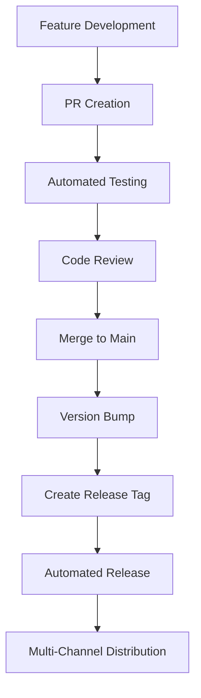

# Adv-EARS Publication Strategy

## Executive Summary

The adv-ears project is a TypeScript-based formal requirements language tool that requires multi-format distribution to serve different user segments effectively. This comprehensive publication strategy outlines the approach for distributing adv-ears as:

- **NPM Library Package**: For developers integrating AEARS parsing and UML generation into their applications
- **VSCode Extension**: For requirements engineers and analysts using AEARS syntax in their daily workflow
- **CLI Tool**: For automation, CI/CD integration, and command-line users

### Strategic Goals
- **Unified Codebase**: Maintain single source of truth with multiple entry points
- **Synchronized Releases**: Ensure version consistency across all distribution channels
- **Quality Assurance**: Implement comprehensive validation before each release
- **Automated Distribution**: Minimize manual intervention in release processes
- **Security First**: Protect credentials and implement secure publishing workflows

### Success Metrics
- Zero-downtime releases across all channels
- <5 minute release cycle from tag to availability
- 100% test coverage for release-critical paths
- Automated rollback capability within 2 minutes

## Release Strategy Overview

### Multi-Format Distribution Approach

The project employs a **monolithic architecture with multiple entry points** strategy:

```
adv-ears/
├── src/
│   ├── index.ts          # NPM library entry point
│   ├── cli/cli.ts        # CLI tool entry point
│   ├── lib/              # Core library functionality
│   ├── lsp/              # Language Server Protocol
│   └── types/            # Shared TypeScript definitions
├── package.json          # NPM package configuration
├── extension.json        # VSCode extension manifest (to be created)
└── dist/                 # Compiled output for all targets
```

### Synchronized Versioning Strategy

- **Single Version Source**: [`package.json`](package.json:3) version field drives all releases
- **Semantic Versioning**: Strict adherence to semver (currently at 0.1.0)
- **Tag-Driven Releases**: Git tags trigger automated release workflows
- **Changelog Automation**: Generate release notes from conventional commits

### Quality Gates and Validation Process

All releases must pass through sequential quality gates:

1. **Code Quality Gate**: Linting, formatting, type checking
2. **Test Validation Gate**: Unit, integration, and contract tests
3. **Build Verification Gate**: Successful compilation for all targets
4. **Security Scanning Gate**: Dependency vulnerability checks
5. **Package Validation Gate**: Verify package contents and metadata

## Initial Publication Plan

### Pre-Publication Checklist

#### 1. Repository Preparation
- [ ] Create VSCode extension manifest (`extension.json`)
- [ ] Configure NPM package metadata in [`package.json`](package.json)
- [ ] Set up GitHub repository secrets for publishing
- [ ] Create comprehensive README for each distribution format
- [ ] Establish changelog format and initial entries

#### 2. Build System Configuration
- [ ] Configure TypeScript compilation for multiple targets
- [ ] Set up bundle optimization for CLI distribution
- [ ] Create VSCode extension packaging workflow
- [ ] Implement tree-shaking for library builds

#### 3. CI/CD Pipeline Setup
- [ ] Enhance existing [`release.yml`](.github/workflows/release.yml:1) workflow
- [ ] Add multi-registry publishing capabilities
- [ ] Implement automated testing for all distribution formats
- [ ] Configure rollback mechanisms

#### 4. Security and Credentials
- [ ] Generate and store NPM authentication token
- [ ] Create VSCode Marketplace Personal Access Token
- [ ] Configure GitHub repository secrets
- [ ] Set up credential rotation procedures

### Launch Sequence and Timing

#### Phase 1: Internal Validation (Week 1)
1. **Day 1-2**: Complete pre-publication checklist
2. **Day 3-4**: Test release workflow in staging environment
3. **Day 5-7**: Conduct security review and penetration testing

#### Phase 2: Soft Launch (Week 2)
1. **Day 1**: Publish to NPM with beta tag
2. **Day 2**: Deploy VSCode extension to private marketplace
3. **Day 3-5**: Internal testing and feedback collection
4. **Day 6-7**: Address critical issues and prepare for public release

#### Phase 3: Public Release (Week 3)
1. **Day 1**: Tag version 1.0.0 and trigger automated release
2. **Day 2**: Monitor release metrics and user feedback
3. **Day 3-7**: Address immediate post-launch issues

## Ongoing Maintenance Procedures

### Regular Release Cadence

- **Major Releases**: Quarterly (breaking changes, new features)
- **Minor Releases**: Monthly (new features, enhancements)
- **Patch Releases**: As needed (bug fixes, security updates)
- **Hotfix Releases**: Within 24 hours for critical security issues

### Update and Patch Processes

#### Standard Update Process
1. **Development**: Feature/fix development in feature branches
2. **Testing**: Comprehensive testing in PR validation
3. **Review**: Code review and approval process
4. **Integration**: Merge to main branch
5. **Release**: Tag-triggered automated release

#### Emergency Patch Process
1. **Hotfix Branch**: Create from latest release tag
2. **Rapid Fix**: Implement minimal fix with focused testing
3. **Fast-Track Review**: Expedited review process
4. **Emergency Release**: Direct tag and release
5. **Post-Release**: Merge hotfix back to main branch

### Version Management Workflow



## CI/CD Pipeline Strategy

### Automated Validation Processes

The existing [`pr-validation.yml`](.github/workflows/pr-validation.yml:1) workflow provides the foundation for release validation:

```yaml
# Enhanced validation pipeline
- Code Quality: ESLint, Prettier, TypeScript compilation
- Testing: Unit, integration, contract tests via npm run check
- Build Verification: Clean build process
- Security Scanning: Dependency vulnerability assessment
```

### Release Automation Workflow

Enhanced [`release.yml`](.github/workflows/release.yml:1) workflow includes:

#### Current Implementation
- Node.js 22 setup with NPM registry configuration
- Dependency installation including VSCode extension tools
- TypeScript compilation and VSCode extension packaging
- GitHub release creation with VSIX artifacts
- NPM and VSCode Marketplace publishing

#### Required Enhancements
```yaml
# Additional steps needed
- name: Security Scan
  run: npm audit --audit-level high

- name: Bundle Analysis
  run: npm run analyze-bundle

- name: CLI Testing
  run: |
    npm run build
    ./dist/cli/cli.js --version
    ./dist/cli/cli.js validate test-syntax.aears

- name: Library API Testing
  run: npm run test:api-contract

- name: Rollback Preparation
  run: |
    echo "PREVIOUS_VERSION=$(npm view adv-ears version)" >> $GITHUB_ENV
    echo "ROLLBACK_READY=true" >> $GITHUB_ENV
```

### Multi-Registry Publishing Approach

#### NPM Registry
- **Target**: `https://registry.npmjs.org`
- **Authentication**: `NODE_AUTH_TOKEN` secret
- **Package Scope**: Public package
- **Distribution Tags**: `latest`, `beta`, `alpha`

#### VSCode Marketplace
- **Target**: Visual Studio Marketplace
- **Authentication**: `VSCE_PAT` (Personal Access Token)
- **Publisher**: To be configured
- **Categories**: Programming Languages, Other

#### GitHub Packages (Optional)
- **Target**: GitHub Package Registry
- **Authentication**: `GITHUB_TOKEN`
- **Scope**: `@amir-arad/adv-ears`
- **Purpose**: Backup distribution channel

## Security and Credentials Management

### Token and Secret Management

#### Required Secrets
```bash
# GitHub Repository Secrets
NPM_TOKEN=npm_xxxxxxxxxxxxxxxxxxxx          # NPM publishing
VSCE_PAT=vsce_xxxxxxxxxxxxxxxxxxxx          # VSCode Marketplace
GITHUB_TOKEN=ghp_xxxxxxxxxxxxxxxxxxxx       # GitHub releases (auto-provided)
SECURITY_SCAN_TOKEN=xxxxxxxxxxxxxxxxxxxx    # Security scanning service
```

#### Secret Rotation Schedule
- **NPM_TOKEN**: Every 90 days
- **VSCE_PAT**: Every 180 days
- **Security Scan Tokens**: Every 60 days

### Access Control Procedures

#### Repository Access
- **Admin Access**: Project maintainer only
- **Write Access**: Core contributors with 2FA enabled
- **Secret Access**: Admin level only
- **Release Triggers**: Protected main branch with required reviews

#### Publishing Permissions
- **NPM**: Single maintainer account with 2FA
- **VSCode Marketplace**: Dedicated publisher account
- **GitHub Releases**: Automated via GitHub Actions

### Security Validation Gates

#### Pre-Release Security Checks
```bash
# Dependency vulnerability scanning
npm audit --audit-level high

# License compliance check
npm run license-check

# Code security analysis
npm run security-scan

# Bundle analysis for malicious code
npm run analyze-bundle
```

#### Post-Release Monitoring
- **Download Metrics**: Monitor unusual download patterns
- **Issue Reports**: Track security-related bug reports
- **Dependency Alerts**: Automated notifications for vulnerable dependencies

## Quality Assurance Framework

### Testing Requirements for Releases

#### Test Categories and Coverage
Based on existing test structure in [`tests/`](tests/):

1. **Unit Tests** ([`tests/unit/`](tests/unit/)): 90% code coverage minimum
   - Parser functionality
   - AST generation
   - UML generation

2. **Integration Tests** ([`tests/integration/`](tests/integration/)): End-to-end workflows
   - LSP server functionality
   - System integration
   - UML generation pipeline

3. **Contract Tests** ([`tests/contract/`](tests/contract/)): API contract validation
   - Library API compliance
   - CLI interface stability
   - LSP protocol adherence

4. **Module Tests** ([`tests/modules/`](tests/modules/)): Feature-specific validation
   - CLI command validation
   - Error handling
   - Extension functionality

#### Release-Specific Testing
```bash
# Pre-release test suite
npm run test:all                    # All existing tests
npm run test:cli-integration        # CLI tool functionality
npm run test:library-api           # Library API contracts
npm run test:vscode-extension      # Extension functionality
npm run test:performance           # Performance benchmarks
```

### Performance Validation

#### Benchmarks and Thresholds
- **Parse Time**: <100ms for 1000-line AEARS files
- **UML Generation**: <500ms for complex diagrams
- **CLI Startup**: <200ms cold start
- **Library Import**: <50ms module load time
- **Memory Usage**: <50MB for typical operations

#### Performance Testing Pipeline
```bash
# Automated performance testing
npm run benchmark:parser
npm run benchmark:uml-generation
npm run benchmark:cli-performance
npm run benchmark:memory-usage
```

### Compatibility Checking

#### Node.js Compatibility
- **Minimum Version**: Node.js 22.0.0 (as specified in [`package.json`](package.json:49))
- **Testing Matrix**: Test against Node.js 22.x, 23.x
- **Platform Support**: Linux, macOS, Windows

#### VSCode Compatibility
- **Minimum Version**: VSCode 1.80.0
- **Extension API**: Language Server Protocol 3.17
- **Platform Support**: All VSCode-supported platforms

## Rollback and Incident Response

### Emergency Rollback Procedures

#### NPM Package Rollback
```bash
# Immediate rollback steps
npm unpublish adv-ears@<problematic-version>  # Within 72 hours only
npm deprecate adv-ears@<problematic-version> "Critical issue - use previous version"

# Alternative: Publish fixed version
npm version patch
npm publish
```

#### VSCode Extension Rollback
```bash
# Extension rollback (requires marketplace support)
vsce unpublish adv-ears <problematic-version>
# Or publish fixed version immediately
vsce publish patch
```

#### GitHub Release Rollback
```bash
# Mark release as pre-release
gh release edit v<version> --prerelease
# Or delete release entirely
gh release delete v<version>
```

### Incident Escalation Process

#### Severity Levels
1. **Critical (P0)**: Security vulnerabilities, data loss, complete service failure
2. **High (P1)**: Major functionality broken, significant user impact
3. **Medium (P2)**: Minor functionality issues, workarounds available
4. **Low (P3)**: Cosmetic issues, documentation errors

#### Response Timeline
- **P0**: Immediate response, rollback within 30 minutes
- **P1**: Response within 2 hours, fix within 24 hours
- **P2**: Response within 24 hours, fix within 1 week
- **P3**: Response within 1 week, fix in next regular release

### Recovery Strategies

#### Automated Recovery
```yaml
# GitHub Actions workflow for automated rollback
name: Emergency Rollback
on:
  workflow_dispatch:
    inputs:
      version:
        description: 'Version to rollback to'
        required: true
      reason:
        description: 'Rollback reason'
        required: true

jobs:
  rollback:
    runs-on: ubuntu-latest
    steps:
      - name: Rollback NPM
        run: npm deprecate adv-ears@latest "${{ github.event.inputs.reason }}"
      
      - name: Notify Team
        run: |
          curl -X POST ${{ secrets.SLACK_WEBHOOK }} \
            -d "{'text':'🚨 Emergency rollback initiated: ${{ github.event.inputs.reason }}'}"
```

#### Manual Recovery Procedures
1. **Assess Impact**: Determine scope and severity
2. **Communicate**: Notify users via GitHub issues, NPM deprecation message
3. **Rollback**: Execute appropriate rollback procedure
4. **Investigate**: Root cause analysis
5. **Fix**: Develop and test fix
6. **Release**: Deploy fixed version
7. **Post-Mortem**: Document lessons learned

## Communication and Documentation

### Release Communication Strategy

#### Pre-Release Communication
- **GitHub Discussions**: Announce upcoming releases and breaking changes
- **README Updates**: Ensure documentation reflects new features
- **Migration Guides**: Provide upgrade instructions for breaking changes

#### Release Announcements
- **GitHub Releases**: Detailed changelog with examples
- **NPM Release Notes**: Concise summary of changes
- **VSCode Marketplace**: Feature highlights and screenshots

#### Post-Release Communication
- **Social Media**: Twitter/LinkedIn announcements for major releases
- **Community Forums**: Engage with users on relevant platforms
- **Blog Posts**: Detailed technical articles for significant features

### Documentation Requirements

#### Package-Specific Documentation

##### NPM Library Documentation
```markdown
# Installation
npm install adv-ears

# Quick Start
import { AEARSLibrary } from 'adv-ears';
const library = new AEARSLibrary();
const result = library.processRequirements('The system shall authenticate users');
```

##### CLI Tool Documentation
```markdown
# Installation
npm install -g adv-ears

# Usage
aears validate requirements.aears
aears generate requirements.aears --output diagram.puml
```

##### VSCode Extension Documentation
```markdown
# Installation
1. Open VSCode
2. Go to Extensions (Ctrl+Shift+X)
3. Search for "AEARS Language Support"
4. Click Install
```

#### API Documentation
- **TypeScript Definitions**: Comprehensive type definitions
- **JSDoc Comments**: Detailed function documentation
- **Examples Repository**: Practical usage examples
- **API Reference**: Auto-generated from source code

### Stakeholder Notification Procedures

#### Internal Stakeholders
- **Development Team**: Slack notifications for all releases
- **QA Team**: Email notifications for beta releases
- **Product Management**: Weekly release summaries

#### External Stakeholders
- **Users**: GitHub release notifications
- **Contributors**: Mention in release notes
- **Integrators**: Breaking change notifications via email

## Implementation Timeline

### Phase 1: Foundation Setup (Weeks 1-2)

#### Week 1: Infrastructure
- [ ] **Day 1-2**: Create VSCode extension manifest and configuration
- [ ] **Day 3-4**: Set up GitHub repository secrets and access controls
- [ ] **Day 5**: Configure NPM package metadata and publishing settings
- [ ] **Day 6-7**: Enhance CI/CD pipeline with security scanning

#### Week 2: Testing and Validation
- [ ] **Day 1-2**: Implement comprehensive test suite for all distribution formats
- [ ] **Day 3-4**: Set up performance benchmarking and monitoring
- [ ] **Day 5**: Create rollback procedures and emergency response workflows
- [ ] **Day 6-7**: Conduct security review and penetration testing

### Phase 2: Beta Release (Weeks 3-4)

#### Week 3: Beta Preparation
- [ ] **Day 1-2**: Package and test beta versions for all distribution channels
- [ ] **Day 3-4**: Deploy to staging environments and conduct integration testing
- [ ] **Day 5**: Release beta versions to limited audience
- [ ] **Day 6-7**: Collect feedback and monitor beta performance

#### Week 4: Beta Refinement
- [ ] **Day 1-3**: Address critical issues identified in beta testing
- [ ] **Day 4-5**: Finalize documentation and release notes
- [ ] **Day 6-7**: Prepare for production release

### Phase 3: Production Release (Week 5)

#### Production Launch
- [ ] **Day 1**: Tag version 1.0.0 and trigger automated release pipeline
- [ ] **Day 2**: Monitor release metrics and user adoption
- [ ] **Day 3**: Address immediate post-launch issues
- [ ] **Day 4-5**: Gather user feedback and plan next iteration
- [ ] **Day 6-7**: Document lessons learned and update procedures

### Phase 4: Ongoing Operations (Week 6+)

#### Operational Excellence
- [ ] **Week 6**: Establish regular release cadence and maintenance procedures
- [ ] **Week 7**: Implement automated monitoring and alerting
- [ ] **Week 8**: Conduct first post-launch retrospective and process improvements
- [ ] **Ongoing**: Monthly release cycles with continuous improvement

### Milestone Definitions

#### M1: Infrastructure Complete
- All CI/CD pipelines operational
- Security measures implemented
- Documentation framework established

#### M2: Beta Release Success
- Beta versions published to all channels
- User feedback collected and analyzed
- Critical issues resolved

#### M3: Production Release
- Version 1.0.0 successfully released
- All distribution channels operational
- Post-launch monitoring active

#### M4: Operational Maturity
- Regular release cadence established
- Automated monitoring and alerting operational
- Team trained on all procedures

### Resource Requirements

#### Human Resources
- **Release Manager**: 0.5 FTE for setup phase, 0.2 FTE ongoing
- **DevOps Engineer**: 0.3 FTE for pipeline setup and maintenance
- **QA Engineer**: 0.2 FTE for release testing and validation
- **Technical Writer**: 0.1 FTE for documentation maintenance

#### Infrastructure Resources
- **GitHub Actions**: Estimated 2000 minutes/month
- **NPM Registry**: Standard publishing account
- **VSCode Marketplace**: Publisher account and verification
- **Monitoring Services**: Basic tier for release monitoring

#### Budget Considerations
- **Tooling Costs**: ~$100/month for premium CI/CD and monitoring services
- **Security Scanning**: ~$50/month for comprehensive vulnerability scanning
- **Documentation Hosting**: ~$20/month for enhanced documentation platform
- **Total Estimated Cost**: ~$170/month operational expenses

---

## Conclusion

This publication strategy provides a comprehensive framework for successfully distributing the adv-ears project across multiple channels while maintaining high quality, security, and reliability standards. The strategy emphasizes automation, security, and user experience while providing clear procedures for both routine operations and emergency situations.

The phased implementation approach ensures a controlled rollout with adequate testing and validation at each stage. Regular review and improvement of these procedures will ensure the publication strategy remains effective as the project evolves and grows.

**Success depends on strict adherence to the quality gates, security procedures, and communication protocols outlined in this document.**